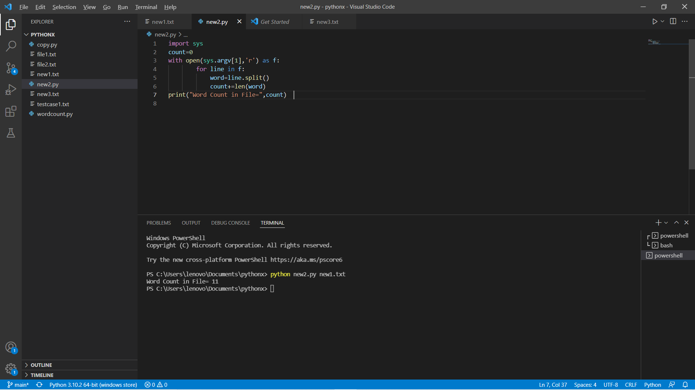

# command-line-arguments-to-count-word
## AIM:
To write a python program for getting the word count from the contents of a file using command line arguments.
## EQUIPEMENT'S REQUIRED: 
PC
Anaconda - Python 3.7
## ALGORITHM: 
### Step 1:
import sys
### Step 2: 
 initially make count = 0
### Step 3: 
open the content file using command line arguments.
### Step 4:  
by using for loop name the function as "line"
### Step 5: 
split the line using .split
### Step 6: 
Run the program to determine the number of words in the file created.
## PROGRAM:
```python
'''
developed by:vinushcv
reg no:22001897
'''
import sys

with open(sys.argv[1],'r') as f:
    num_of_words =0
    for i in f:
        word =i.split()
        num_of_words += len(word)
print("Number of words={}".format(num_of_words))
```
### OUTPUT:



## RESULT:
Thus the program is written to find the word count from the contents of a file using command line arguments.
